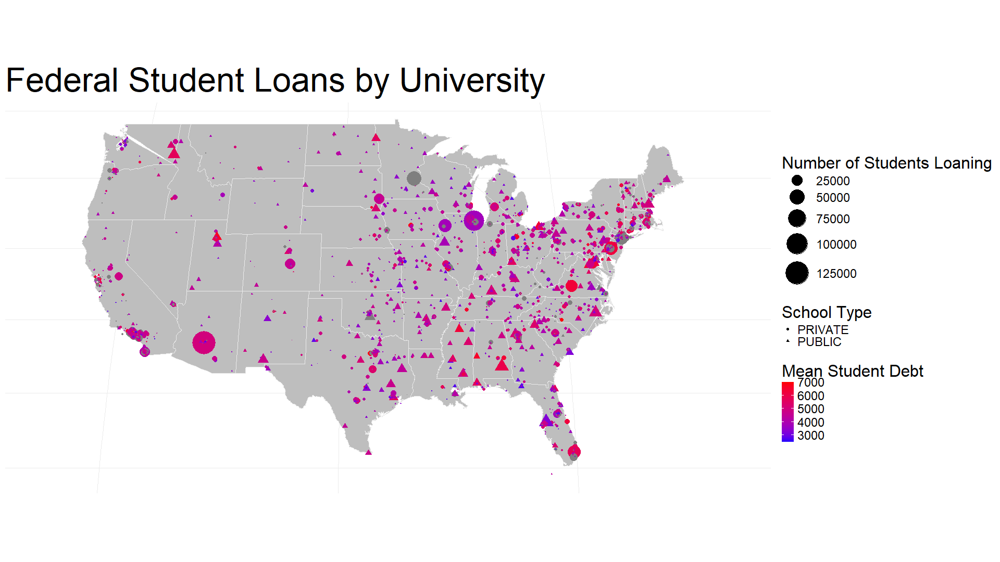

# Student Loans
***R generated Dot Density Map for federal student loans by university***

[Built With](#built-with) · [Features](#features)

## Built With
- 

## Features

### Data from the Department of Education
All data was extracted from a [database](https://catalog.data.gov/dataset/national-student-loan-data-system-722b0) by the Office of Federal Student Aid including how much was loaned to students of each university in the 2009-2010 academic year.  

### Data cleaning
Removed universities with little information and foreign (non-US-mainland) institutions.

### "Dot Density Map"
The graph displays a geographical map of mainland US with each point representing a different university. Information about each point is visualised through its properties as labeled in the legend at the right:

- Size is relative to the number of students receiving loans by institution
- Its shape represents the type of institution (i.e. triangle for a public university and circle for a private/proprietary university)
- The amount of loans giving on average to each student is represented on a colour scale with red as the highest and blue as the lowest